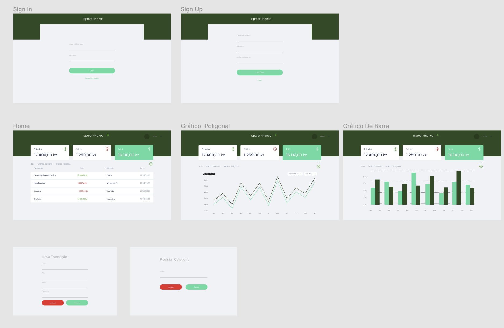
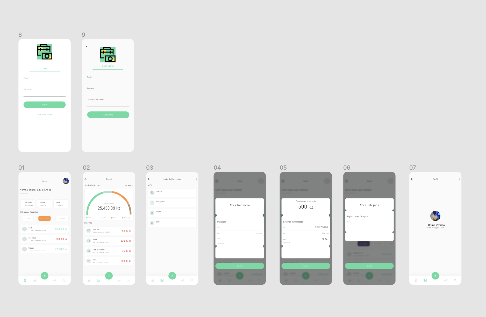

# Isptec Finance - Aplicação de Gestão de Gastos Pessoais

A Isptec Finance é uma aplicação de gestão de gastos pessoais projetada para ajudar os usuários a controlar e gerenciar suas finanças de forma eficaz. Com recursos intuitivos e poderosos, a aplicação permite que você acompanhe suas despesas, crie orçamentos e tome decisões financeiras informadas.

## Características Principais

- **Rastreamento de Despesas:** Registre todas as suas transações financeiras, categorize-as e visualize suas despesas de maneira clara e organizada.

- **Orçamentação:** Defina metas financeiras mensais e acompanhe seu progresso. A aplicação enviará alertas quando você estiver se aproximando de exceder o orçamento.

- **Visualizações Gráficas:** Visualize seus gastos e orçamentos por meio de gráficos e gráficos interativos para uma compreensão mais profunda da sua situação financeira.

- **Planejamento Financeiro:** Crie planos para economizar para objetivos específicos, como viagens, educação ou compra de um carro. Acompanhe seu progresso e faça ajustes conforme necessário.

Tecnologias Utilizadas
----------------------

*   Nodejs
*   React-Native
*   React

  

## Contribuição

Agradecemos contribuições da comunidade! Se você deseja contribuir para o desenvolvimento da Isptec Finance, siga estas etapas:

1. Faça um fork deste repositório.
2. Crie um branch para suas alterações: `git checkout -b feature/nova-funcionalidade`.
3. Faça suas alterações e commit: `git commit -m 'Adiciona nova funcionalidade'`.
4. Envie para o seu fork: `git push origin feature/nova-funcionalidade`.
5. Crie um Pull Request neste repositório.

## Suporte

Se você encontrar problemas ou tiver dúvidas, abra um problema [aqui](https://github.com/brunovivaldodev/finance/issues).

## Licença

Este projeto é licenciado sob a [Licença MIT](LICENSE).
